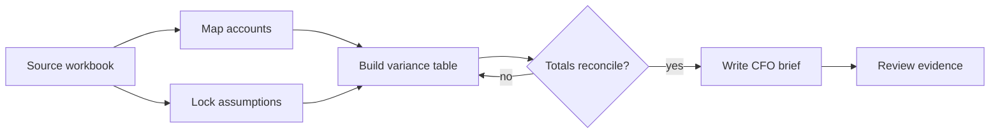
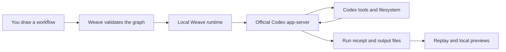

<div align="center">

# WeaveCodex

**Draw the workflow. Let Codex execute it. Inspect every handoff.**

[](weave-control-plane/pyproject.toml)
[](LICENSE)
[](SECURITY.md)

An open-source visual control layer for Codex. Build reusable workflows from draggable nodes,
run them through your existing ChatGPT/Codex sign-in, and review the resulting steps and files.

> WeaveCodex is an independent project. It is not an OpenAI product.

</div>

## Why WeaveCodex?

Codex is excellent at choosing tools and adapting during a task. A long prompt, however, is a poor
interface for a process that must be reused, reviewed, or calibrated by other people.

WeaveCodex adds an editable graph around the native Codex runtime:

| Regular Codex | With WeaveCodex |
| --- | --- |
| One goal describes the whole job | Nodes divide the job into explicit handoffs |
| Completion criteria live in prose | Checks and review rules are visible steps |
| A correction is another chat message | A calibration node records where the route changed |
| The process is difficult to reuse | Workflows can be saved and applied to another folder |
| Files must be opened separately | Tables, workbooks, images, media, and text render inside Runs |

## The canvas

Each node has a human-readable purpose and a declared execution type:

- **Codex task:** a broad or focused Codex turn with native filesystem and tool access.
- **Exact check:** run a command or test and record its observed result.
- **Calibration:** pause so a person can continue, redirect the next step, or stop.
- **Review:** evaluate the visible output and optionally run a bounded repair.
- **Arrow:** define the dependency and handoff order.

The graph can be high level, such as research, design, implementation, and launch, or deliberately
fine grained, such as calculate one table, run one test, and verify one file.



## How it runs



Weave owns the workflow order, checkpoints, exact checks, saved designs, and replay UI. Codex keeps
its own adaptive agent loop, tool use, sandbox, approvals, context management, and authentication.

## Quick start

### Requirements

- Python 3.11 or newer
- [uv](https://docs.astral.sh/uv/)
- The [Codex CLI](https://developers.openai.com/codex/cli) installed locally
- A Codex login, including ChatGPT subscription login via `codex login`

### Install

```bash
git clone https://github.com/MustafaAH10/WeaveCodex.git
cd WeaveCodex/weave-control-plane
uv sync
codex login
```

### Start the local app

```bash
uv run python -m weave_codex.server \
  --codex-bin "$(command -v codex)" \
  --host 127.0.0.1 \
  --port 8790
```

Open [http://127.0.0.1:8790](http://127.0.0.1:8790).

The app reuses the login managed by the official Codex CLI. It does not copy authentication tokens
into this repository or ask you to paste an API key into the browser.

## Product flow

1. Describe the outcome and choose a repository or folder.
2. Start with a blank canvas or load an example.
3. Add, edit, connect, and drag the steps into the process you want.
4. Save the workflow if you want to reuse it.
5. Run it with Codex.
6. Continue, redirect, or stop at calibration points.
7. Replay the run and inspect its generated files.

Saved workflows store the process rather than a specific repository. Load one in a new folder,
change the goal and node descriptions, and run the same control pattern again.

## What is observable?

Runs records the authored step order, status, human feedback, exact command evidence, visible node
inputs and outputs, and files created or changed by the run. Safe local previews currently support:

- CSV and TSV tables
- XLSX and XLSM cell grids with sheet selection
- PNG, JPEG, WebP, GIF, and SVG images
- audio and video
- Markdown, JSON, source code, and other text files

Secret-looking files, symlinks, oversized files, and files not bound to the run are excluded from
the preview surface.

## Project structure

```text
weave-control-plane/
├── weave_codex/
│   ├── server.py             # loopback HTTP API
│   ├── runtime.py            # workflow execution and receipts
│   ├── phase_program.py      # graph validation and compilation
│   ├── artifact_preview.py   # safe local output rendering
│   └── static/               # canvas application
├── sdk/python/               # typed Codex app-server client
└── tests/
```

The integration is additive and communicates with Codex through its official local app-server
protocol. See the [control-plane guide](weave-control-plane/README.md) for API and implementation
details, and [UPSTREAM.md](weave-control-plane/UPSTREAM.md) for the pinned dependency boundary.

## Validation

The repository includes unit, security, browser-contract, graph, workflow-reuse, and bounded
end-to-end acceptance tests.

```bash
cd weave-control-plane
uv run ruff check .
uv run ruff format --check .
uv run pytest -q tests
node --check weave_codex/static/home.js
```

The tracked [platform workflow trials](experiments/platform-workflow-trials/results-v2/RESULTS.md)
exercise coding, visual design, local operations, and support workflows through the same local
runtime. They validate execution and observability, not a general model-quality advantage.

## Security

The functional app binds to loopback and can operate on files with the permissions granted to
Codex. Do not expose it directly to a public network. Review [SECURITY.md](SECURITY.md) before
changing the host, authentication, or browser boundary.

## Contributing

Issues and focused pull requests are welcome. Start with
[CONTRIBUTING.md](weave-control-plane/CONTRIBUTING.md), keep the canvas model executable, and add
tests for changes to workflow semantics or the local security boundary.

## License

Apache License 2.0. See [LICENSE](LICENSE) and [NOTICE](NOTICE).
