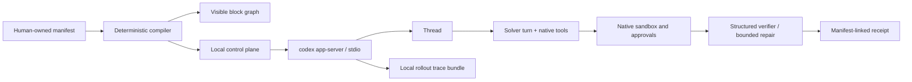

# Weave Codex control plane

Weave Codex is an additive local UI for designing how Codex app-server executes a task. It does
not replace Codex's agent loop, tools, sandbox, authentication, or approval protocol. A typed JSON
manifest chooses those controls and compiles to concrete app-server operations.



## What is editable

| Block | Manifest field | Runtime effect |
|---|---|---|
| Task and context | `task` | Becomes the first turn input; paths are explicit hints, not pre-read claims. |
| Memory | `memory.mode` | `off` disables memory read/generation; `all` enables the native Codex memory store and marks the thread eligible; `selected` disables native memory and injects bounded excerpts from exact thread IDs. |
| Agent loop | `agent.model`, `reasoningEffort` | Passed to Codex; native tools and context management remain Codex-owned. |
| Safety | `agent.sandbox`, `approvalGate` | Passed to `thread/start`; manual app-server approval requests pause in the UI. |
| Verification | `verification` | Runs a JSON-schema-constrained later turn and at most two declared repair checks. |
| Observability | `observability.traceRoot` | Enables Codex's local rollout-trace bundle and records a separate manifest-linked receipt. |

`maximumTurns` bounds control-plane turns. It does not pretend to cap internal Codex tool calls;
that would require a separate app-server capability.

## Launch

Prerequisites: Python 3.11+, `uv`, a `codex` binary, and an existing Codex login. No API key is
copied into this project.

```bash
cd weave-control-plane
uv sync
uv run python -m weave_codex.server \
  --codex-bin "$(command -v codex)" \
  --host 127.0.0.1 \
  --port 8790
```

Open `http://127.0.0.1:8790`. The default design is read-only, has memory off, and denies
permission escalation. Choose **Selected** memory and load saved workspace threads to inject only
checked histories; the receipt lists the requested/resolved IDs and hashes each excerpt. In **All**
mode, Codex decides which consolidated memories are relevant, so the receipt does not invent exact
source-thread IDs.

## Test

```bash
uv run pytest
uv run ruff check .
```

The tests use a deterministic fake gateway. They verify compilation, exact selected-memory scope,
bounded repair, receipt fields, and the blocking manual-approval handshake. A live run is distinct:
it reuses the machine's Codex authentication and is clearly reported as such.

## Current boundary

This first version intentionally lives in `weave-control-plane/`. No `codex-core`, TUI, or
app-server protocol code is modified. The runtime uses the pinned Python SDK and these existing v2
operations: `initialize`, `thread/list`, `thread/read`, `thread/start`,
`thread/memoryMode/set`, `turn/start`, event notifications, and approval responses.

See [UPSTREAM.md](UPSTREAM.md) for exact source provenance and update policy.
