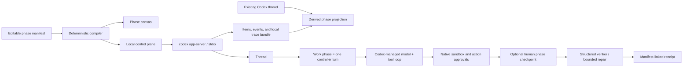

# Weave Codex control plane

Weave Codex is an additive local UI for observing existing Codex threads and designing how
app-server executes a task. It does not replace Codex's agent loop, tools, sandbox,
authentication, or approval protocol. A typed manifest compiles a small number of human-owned
phases to concrete app-server operations. Each Codex Work phase may contain many model and tool
iterations.



## What is editable

| Block | Manifest field | Runtime effect |
|---|---|---|
| Task and context | `task` | Defines the overall goal; paths are explicit hints, not pre-read claims. |
| Memory | `memory.mode` | `off` disables memory read/generation; `all` enables the native Codex memory store and marks the thread eligible; `selected` disables native memory and injects bounded excerpts from exact thread IDs. |
| Work phase | `phaseProgram.phases[].kind=work` | Starts one controller turn. Codex owns all reasoning, tools, compaction, and adaptation inside it. |
| Human checkpoint | `phaseProgram.phases[].kind=checkpoint` | Pauses between turns for a continue-or-stop decision without calling a model. |
| Verification | `phaseProgram.phases[].kind=verify` | Runs a JSON-schema-constrained later turn and at most two declared repair turns. |
| Safety | `agent.sandbox`, `approvalGate` | Applies run-wide; native action-approval requests can pause inside any Work phase. |
| Observability | `observability.traceRoot` | Enables Codex's local rollout-trace bundle and records a separate manifest-linked receipt. |

`maximumTurns` bounds control-plane turns. It does not pretend to cap internal Codex tool calls;
that would require a separate app-server capability.

## Launch

Prerequisites: Python 3.11+, `uv`, a `codex` binary, and an existing Codex login. No API key is
copied into this project.

```bash
cd weave-control-plane
uv sync
uv run python -m weave_codex.server \
  --codex-bin "$(command -v codex)" \
  --host 127.0.0.1 \
  --port 8790
```

Open `http://127.0.0.1:8790`. Start in **Observe** to inspect a saved Weave run or project an
existing Codex thread into privacy-reduced, explicitly derived phases. Open **Build** to add,
remove, reorder, and edit Work, Human Checkpoint, and Verification phases. The default design is
read-only and has memory off.

Choose **Selected** memory and load saved workspace threads to inject only checked histories; the
receipt lists the requested/resolved IDs and hashes each excerpt. In **All** mode, Codex decides
which consolidated memories are relevant, so the receipt does not invent exact source-thread IDs.

## Test

```bash
uv run pytest
uv run ruff check .
```

The tests use deterministic fake gateways and protocol fixtures. They verify phase compilation,
multi-turn execution, phase checkpoints, exact selected-memory scope, bounded repair, trace
projection, receipt fields, and the native action-approval handshake. A live run is distinct: it
reuses the machine's Codex authentication and is clearly reported as such.

## Current boundary

This first version intentionally lives in `weave-control-plane/`. No `codex-core`, TUI, or
app-server protocol code is modified. The runtime uses the pinned Python SDK and these existing v2
operations: `initialize`, `thread/list`, `thread/read`, `thread/start`,
`thread/memoryMode/set`, `turn/start`, event notifications, and approval responses.

Read [Codex is not a flowchart](docs/CODEX_HARNESS_INTERNALS.md) for the source-level architecture
and [the source evidence ledger](docs/CODEX_SOURCE_AUDIT.md) for claim-to-symbol provenance.

See [UPSTREAM.md](UPSTREAM.md) for exact source provenance and update policy.
