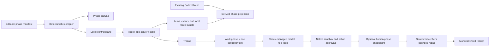

# Weave Codex control plane

Weave Codex is an additive local UI for observing existing Codex threads and designing how
app-server executes a task. It does not replace Codex's agent loop, tools, sandbox,
authentication, or approval protocol. A typed manifest compiles a small number of human-owned
phases to concrete app-server operations. Each Codex Work phase may contain many model and tool
iterations.



## What is editable

| Block | Manifest field | Runtime effect |
|---|---|---|
| Task and context | `task` | Defines the overall goal; paths are explicit hints, not pre-read claims. |
| Memory | `memory.mode` | `off` disables memory read/generation; `all` enables the native Codex memory store and marks the thread eligible; `selected` disables native memory and injects bounded excerpts from exact thread IDs. |
| Work phase | `phaseProgram.phases[].kind=work` | Starts one controller turn. Codex owns all reasoning, tools, compaction, and adaptation inside it. |
| Human checkpoint | `phaseProgram.phases[].kind=checkpoint` | Pauses between turns for a continue-or-stop decision without calling a model. |
| Verification | `phaseProgram.phases[].kind=verify` | Runs a JSON-schema-constrained later turn and at most two declared repair turns. |
| Safety | `agent.sandbox`, `approvalGate` | Applies run-wide; native action-approval requests can pause inside any Work phase. |
| Integrations | `integrations.requested[]` | Requests a Skill, MCP server, or connected App in all Work phases or exact named phases; the receipt reports the request separately from observable use. |
| Observability | `observability.traceRoot` | Enables Codex's local rollout-trace bundle and records a separate manifest-linked receipt. |

`maximumTurns` bounds control-plane turns. It does not pretend to cap internal Codex tool calls;
that would require a separate app-server capability.

## Launch

Prerequisites: Python 3.11+, `uv`, a `codex` binary, and an existing Codex login. No API key is
copied into this project.

```bash
cd weave-control-plane
uv sync
uv run python -m weave_codex.server \
  --codex-bin "$(command -v codex)" \
  --host 127.0.0.1 \
  --port 8790
```

When launched from `weave-control-plane/`, the parent repository is selected as the initial
workspace. Use `--workspace-root /absolute/path/to/project` to choose another default; the Design
page can change it before a run.

Open `http://127.0.0.1:8790`. The product is organized as a short, explicit journey:

1. **Why Weave** explains the boundary: people author goal-level phases and handoffs, while Codex
   keeps control of the adaptive model-and-tool loop inside each Work phase.
2. **Examples** compares ordinary Codex with a reviewable Weave program for a frontend task and a
   diagnosis-first program for a bug repair. These are architectural comparisons, not benchmark
   claims.
3. **Design** lets you edit Work, Human Checkpoint, and Verify + Repair phases, then inspect the
   exact app-server operations before execution.
4. **Runs** starts with a deterministic task-to-output map. Saved Weave receipts show exact authored
   phases; existing Codex threads show explicitly derived activity groups. Result, activity, raw
   notifications, and receipt JSON are progressive-disclosure tabs rather than one long trace wall.
5. **Integrations** reads a secret-free inventory of workspace Skills, configured MCP servers, and
   connected Apps from the local Codex app-server. Any of the three can be requested in all Work
   phases or one named phase. AGENTS.md remains inherited, credentials and policy remain
   Codex-owned, and the receipt distinguishes a request from an observed MCP/dynamic tool item.
6. **Setup** checks the native Codex account and starts the official ChatGPT browser flow when
   sign-in is required.

Open `http://127.0.0.1:8790/compare.html` to place a Codex-only thread projection beside an exact
Weave receipt. The comparison reports observable structure and human coordination; it does not
claim answer-quality improvement unless an external matched evaluation exists.

That comparison page also contains [three matched memory-off product trials](docs/MATCHED_CODEX_WEAVE_TRIALS.md).
All six artifacts passed, while Weave used 46 model completions versus 15 for ordinary Codex. The
result is presented as an observability/compute tradeoff, not an improvement claim.

For a Codex-first explanation, open `http://127.0.0.1:8790/deep-dive.html`. The article initially
describes Codex by itself. **Reveal Weave layer** then adds track-change annotations and transforms
the architecture to show the exact additions.

Choose **Selected** memory and load saved workspace threads to inject only checked histories; the
receipt lists the requested/resolved IDs and hashes each excerpt. In **All** mode, Codex decides
which consolidated memories are relevant, so the receipt does not invent exact source-thread IDs.

## Authentication and subscription use

Weave spawns the official local `codex app-server` and inherits the same environment and default
`CODEX_HOME` as the Codex CLI. If the user is already signed in with ChatGPT, that Codex-managed
session is reused and eligible usage remains attached to the user's ChatGPT subscription. Weave
does not read or copy `auth.json`, access tokens, email addresses, or API keys.

The Setup page reads a secret-free status through `account/read`. If sign-in is required, an
explicit click starts the documented `account/login/start` ChatGPT browser flow. The app-server,
not Weave, owns the callback and credential storage. Weave is loopback-only and protects all local
POST endpoints with a per-process session token and same-origin checks.

## Test

```bash
uv run pytest
uv run ruff check .
```

The tests use deterministic fake gateways and protocol fixtures. They verify phase compilation,
multi-turn execution, phase checkpoints, exact selected-memory scope, bounded repair, trace
projection, receipt fields, and the native action-approval handshake. A live run is distinct: it
reuses the machine's Codex authentication and is clearly reported as such.

## Current boundary

This first version intentionally lives in `weave-control-plane/`. No `codex-core`, TUI, or
app-server protocol code is modified. The runtime uses the pinned Python SDK and these existing v2
operations: `initialize`, `thread/list`, `thread/read`, `thread/start`,
`thread/memoryMode/set`, `turn/start`, event notifications, and approval responses.
The read-only Integrations page additionally uses `skills/list`, `mcpServerStatus/list`, and
`app/list`; it does not read Codex configuration files or connector credentials directly.

Read [Codex is not a flowchart](docs/CODEX_HARNESS_INTERNALS.md) for the source-level architecture
and [the source evidence ledger](docs/CODEX_SOURCE_AUDIT.md) for claim-to-symbol provenance.

See [UPSTREAM.md](UPSTREAM.md) for exact source provenance and update policy.
