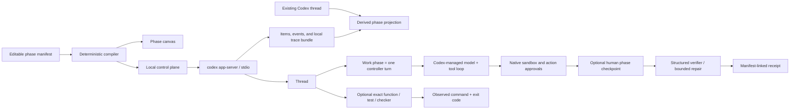

# Weave Codex control plane

Weave Codex is a local control plane for people who want Codex to follow an explicit working
agreement. Describe a goal by typing or browser-native dictation, choose where Codex should pause,
and decide what evidence must pass before the work is complete. The resulting contract can be
reviewed, saved, and reused for another task.

Weave does not replace Codex's agent loop, tools, sandbox, authentication, or approval protocol.
A typed manifest compiles human-owned phases to concrete app-server operations. A person chooses
the resolution of each node: a broad or focused Codex Work phase may contain many model and tool
iterations, while an exact function, test, or checker phase requires one observed command and exit
code. The canvas does not force either style.



## What is editable

| Block | Manifest field | Runtime effect |
|---|---|---|
| Task and context | `task` | Defines the overall goal; paths are explicit hints, not pre-read claims. |
| Memory | `memory.mode` | `off` disables memory read/generation; `all` enables the native Codex memory store and marks the thread eligible; `selected` disables native memory and injects bounded excerpts from exact thread IDs. |
| Work phase | `phaseProgram.phases[].kind=work`, `scope` | Starts one controller turn. `adaptive` delegates the internal route; `focused` prohibits adjacent work. Codex still owns its internal reasoning and tools. |
| Exact command | `phaseProgram.phases[].kind=command` | Starts one low-effort Codex turn for exactly one function, test, or checker command. Pass requires one matching app-server command item and the declared exit code. |
| Human checkpoint | `phaseProgram.phases[].kind=checkpoint` | Pauses without a model call; the user can continue, redirect the next phase with bounded text feedback, or stop. |
| Verification | `phaseProgram.phases[].kind=verify` | Runs a JSON-schema-constrained later turn and at most two declared repair turns. |
| Safety | `agent.sandbox`, `approvalGate` | Applies run-wide; native action-approval requests can pause inside any Work phase. |
| Integrations | `integrations.requested[]` | Requests a Skill, MCP server, or connected App; the manifest API supports all Work phases or exact named phases, while the current simplified UI requests across all Work phases. The receipt reports a request separately from observable use. |
| Observability | `observability.traceRoot` | Enables Codex's local rollout-trace bundle and records a separate manifest-linked receipt. |

`maximumTurns` bounds control-plane turns. It does not pretend to cap internal Codex tool calls;
that would require a separate app-server capability. A visible Stop button uses native
`turn/interrupt` to end the active Codex turn and records the phase as stopped.

## Launch

Prerequisites: Python 3.11+, `uv`, a `codex` binary, and an existing Codex login. No API key is
copied into this project.

```bash
cd weave-control-plane
uv sync
uv run python -m weave_codex.server \
  --codex-bin "$(command -v codex)" \
  --host 127.0.0.1 \
  --port 8790
```

When launched from `weave-control-plane/`, the parent repository is selected as the initial
workspace. Use `--workspace-root /absolute/path/to/project` to choose another default; Build can
change it before a run.

Open `http://127.0.0.1:8790`. This is the only supported product URL. The default journey is
deliberately short:

1. **Describe the outcome** by speaking or typing. Voice entry uses the browser's dictation
   capability, so availability and audio handling depend on the browser; text remains the fallback.
2. **Draw the control loop:** start blank or load an example, place nodes freely, connect them with
   arrows, and decide the meaning and resolution of every node. A Codex-turn node may own an entire
   subsystem or one narrow operation; exact-command and verifier nodes provide finer-grained gates.
3. **Run it.** Codex follows the dependency order drawn on the canvas. One Codex-turn node may still
   contain many native model and tool iterations; arrows coordinate turns rather than individual
   tool calls.
4. **Save from the canvas or under Saved** without the original task or repository, then reuse or
   visibly adapt it for another task. Saved also contains Codex skills, connectors, and account
   setup.
5. **Review Runs** starting from the goals and human decisions—not internal IDs or protocol
   objects. Product checks are available below personal runs as optional evidence.

Exact selected-memory controls, raw manifests, and machine-readable identifiers remain runtime/API
capabilities rather than controls exposed in the simplified first-run screen.

Runs can also render the tracked four-domain container study directly from its sanitized
outcome receipt. Across coding, design, local-connector operations, and support simulation, both
the one-turn baseline and Weave produced accepted artifacts (8/8 arms). Weave reached four explicit
planning gates. This is one rollout per arm and supports a control/observability claim only; it is
not evidence that Weave improves Codex quality, cost, or call efficiency. Full methods and public
artifacts are in [the trial report](../experiments/platform-workflow-trials/results-v2/RESULTS.md).

The optional evidence disclosure under Runs contains
[three matched memory-off product trials](docs/MATCHED_CODEX_WEAVE_TRIALS.md).
All six artifacts passed, while Weave used 46 model completions versus 15 for ordinary Codex. The
result is presented as an observability/compute tradeoff, not an improvement claim.

The local Build tab stays focused on the executable canvas. Product explanation and comparison live
on the separate static public website; the longer source-level audit remains repository
documentation at [Codex is not a flowchart](docs/CODEX_HARNESS_INTERNALS.md).

Through the manifest/runtime API, **Selected** memory can inject only explicitly named workspace
threads; the receipt lists requested/resolved IDs and hashes each excerpt. In **All** mode, Codex
decides which consolidated memories are relevant, so the receipt does not invent exact
source-thread IDs. These exact memory controls are not exposed in the current novice interface.

## Authentication and subscription use

Weave spawns the official local `codex app-server` and inherits the same environment and default
`CODEX_HOME` as the Codex CLI. If the user is already signed in with ChatGPT, that Codex-managed
session is reused and eligible usage remains attached to the user's ChatGPT subscription. Weave
does not read or copy `auth.json`, access tokens, email addresses, or API keys.

The Account and setup drawer under Saved reads a secret-free status through `account/read`. If
sign-in is required, an explicit click starts the documented `account/login/start` ChatGPT browser
flow. The app-server, not Weave, owns the callback and credential storage. Weave is loopback-only
and protects all local POST endpoints with a per-process session token and same-origin checks.

## Test

```bash
uv run pytest
uv run ruff check .
```

The tests use deterministic fake gateways and protocol fixtures. They verify phase compilation,
multi-turn execution, phase checkpoints, exact selected-memory scope, bounded repair, trace
projection, receipt fields, and the native action-approval handshake. A live run is distinct: it
reuses the machine's Codex authentication and is clearly reported as such.

## Current boundary

This first version intentionally lives in `weave-control-plane/`. No `codex-core`, TUI, or
app-server protocol code is modified. The runtime uses the pinned Python SDK and these existing v2
operations: `initialize`, `thread/list`, `thread/read`, `thread/start`,
`thread/memoryMode/set`, `turn/start`, event notifications, and approval responses.
The read-only integrations drawer under Saved additionally uses `skills/list`,
`mcpServerStatus/list`, and `app/list`; it does not read Codex configuration files or connector
credentials directly.

Read [Codex is not a flowchart](docs/CODEX_HARNESS_INTERNALS.md) for the source-level architecture
and [the source evidence ledger](docs/CODEX_SOURCE_AUDIT.md) for claim-to-symbol provenance.

See [UPSTREAM.md](UPSTREAM.md) for exact source provenance and update policy.
