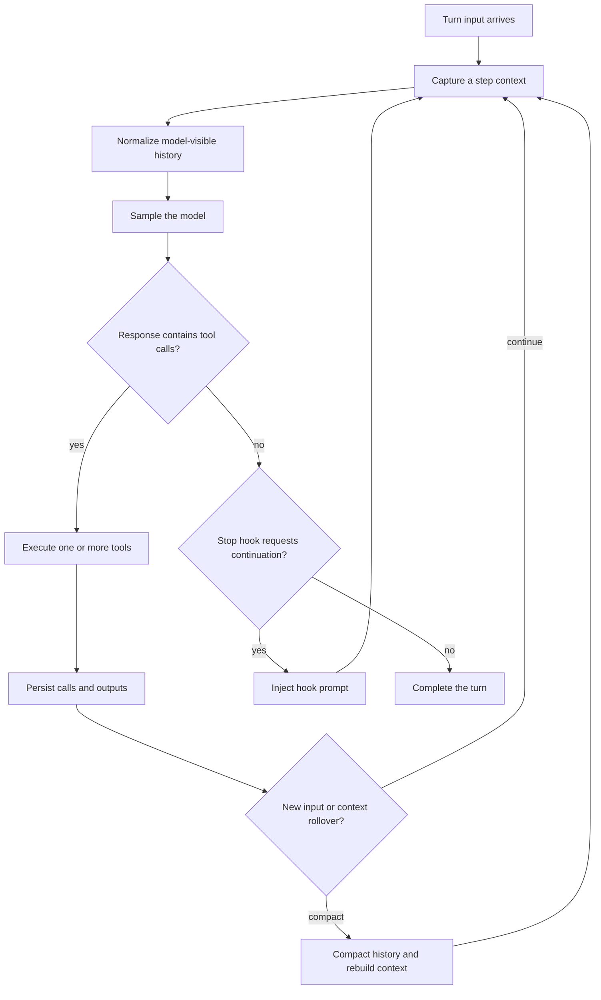
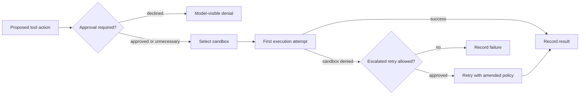
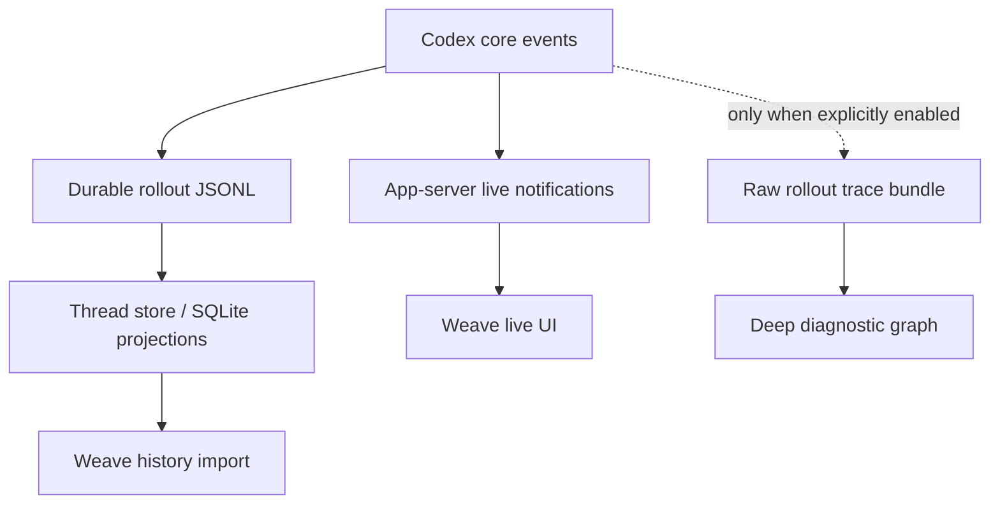
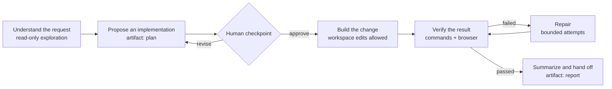
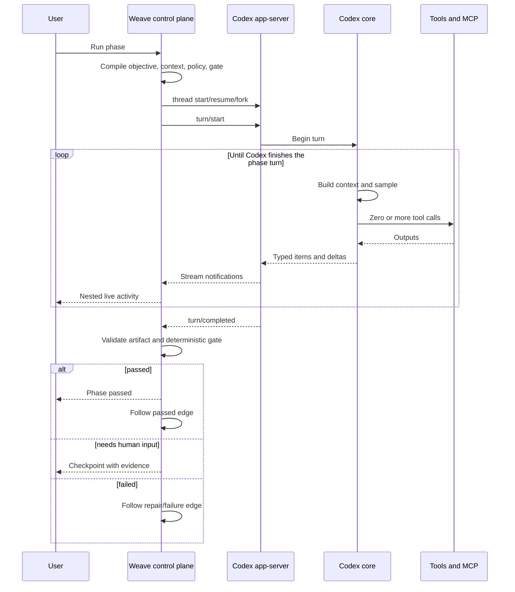

# Codex is not a flowchart

## A source-level anatomy of the agent loop—and the right way to make it editable

Codex can look deceptively simple from the outside. A person enters a task; the
agent reads files, runs commands, edits code, and eventually returns an answer.
That surface invites the wrong abstraction: a canvas where every box means one
tool call and every arrow predicts the next call.

The implementation does not work that way.

One Codex turn contains a model-driven loop. A single model response may request
several tools. Tool results are appended to the conversation, another sample is
made, and the cycle continues until the model produces a terminal response—or a
hook, new user input, compaction, error, or interruption changes the course of
the turn. A task such as “redesign this frontend” may legitimately involve a
hundred command, read, edit, image, browser, and verification events. Those
events are the *inside* of an instruction, not a useful hundred-node workflow.

That observation changes the product design. An editable Codex harness should
control **phases, contracts, capabilities, checkpoints, and transitions**. Codex
should retain control over the fine-grained inference/tool loop inside each
phase. The canvas becomes a program *around* the agent rather than a brittle
attempt to replace the agent.

This article establishes that claim from the public app-server contract and a
pinned audit of the OpenAI Codex source. It then proposes a control-plane
architecture that uses the surfaces Codex really exposes.

---

## Evidence and scope

Three labels appear throughout:

- **Documented** means the behavior is part of OpenAI's published app-server or
  Codex documentation.
- **Source-derived** means the behavior was observed in the pinned source tree.
  It describes that implementation, not a forever-stable public contract.
- **Proposal** means it is a Weave design choice or an inference from the two
  evidence layers above.

The source audit is pinned to OpenAI Codex commit
[`9ded177ce7c1c0bd2047f902936c177612ab3434`](https://github.com/openai/codex/tree/9ded177ce7c1c0bd2047f902936c177612ab3434),
tree `80af093a595d2e4a0b45dd666f5390e9dbad5d98`. This private downstream imported
that exact tree at local commit `34998ea`; see
[`UPSTREAM.md`](../UPSTREAM.md). Source links below are commit-pinned rather
than links to a moving `main` branch.

The public contract is described in OpenAI's current
[`codex app-server` documentation](https://learn.chatgpt.com/docs/app-server).
The repository's own
[`codex-rs/app-server/README.md`](https://github.com/openai/codex/blob/9ded177ce7c1c0bd2047f902936c177612ab3434/codex-rs/app-server/README.md)
is the version-matched protocol reference. The two are complementary: the
public page is the supported integration guide; the pinned README and Rust
types tell us exactly what this build implements. Experimental fields remain
experimental even when their implementation is visible.

This audit covers the open-source client and agent runtime. It cannot reveal
model weights, training data, hidden service-side routing, or private desktop
application code. The companion
[`CODEX_SOURCE_AUDIT.md`](./CODEX_SOURCE_AUDIT.md) maps each major claim to the
exact file and symbol family inspected.

---

## 1. The actual unit of agency

### The public object model

**Documented.** App-server exposes three primary objects:

1. A **thread** is the durable conversation.
2. A **turn** is one user-to-agent interaction within a thread.
3. An **item** is a typed unit inside a turn: a user message, agent message,
   reasoning item, command, file edit, MCP call, and so on.

The lifecycle begins with one `initialize` request and `initialized`
notification per transport connection. The client then creates, resumes, or
forks a thread; starts a turn; consumes notifications; and receives a terminal
`turn/completed`. The pinned build supports JSONL over stdio, an experimental
WebSocket transport, and local app-server control via a Unix socket. The
wire protocol is JSON-RPC 2.0-shaped but omits the `jsonrpc: "2.0"` member.

App-server is deliberately a typed integration boundary. The binary can
generate TypeScript declarations or JSON Schema matching its own version:

```bash
codex app-server generate-ts --out generated
codex app-server generate-json-schema --out generated
```

Experimental methods and fields are excluded unless generation uses
`--experimental`, and clients opt in at initialization with
`capabilities.experimentalApi: true`. A serious integration must generate from
the binary it ships against; copying types from a blog post is not sufficient.

### The turn is itself a loop

**Source-derived.** The central implementation is
[`codex-rs/core/src/session/turn.rs`](https://github.com/openai/codex/blob/9ded177ce7c1c0bd2047f902936c177612ab3434/codex-rs/core/src/session/turn.rs).
Its `run_turn` documentation and control flow define the core agent loop:



The loop captures a step snapshot, builds the Responses request from normalized
history and the current tool registry, samples the model, executes requested
tools, records their results, and samples again when follow-up is required. It
also drains user steering input between samples. A stop hook may inject another
prompt and force a continuation even after the model appears finished.

The request sets `parallel_tool_calls: true`. In
[`tools/parallel.rs`](https://github.com/openai/codex/blob/9ded177ce7c1c0bd2047f902936c177612ab3434/codex-rs/core/src/tools/parallel.rs),
parallel-safe tools take a shared read lock while tools that require
serialization take a write lock. Results are drained in response order through
ordered futures. Therefore “the model called three tools” does not imply either
three sequential workflow stages or three independent branches.

**Conclusion.** A `ThreadItem` is an observability and persistence unit. It is
not the right authoring unit. Mapping each item to a canvas block would expose
implementation chatter, encourage users to predict an inherently adaptive
sequence, and make ordinary Codex behavior look like a workflow failure.

---

## 2. Protocol and type surfaces

### Thread state

**Source-derived.** The v2 types live in
[`app-server-protocol/src/protocol/v2`](https://github.com/openai/codex/tree/9ded177ce7c1c0bd2047f902936c177612ab3434/codex-rs/app-server-protocol/src/protocol/v2).
The `Thread` record in
[`thread_data.rs`](https://github.com/openai/codex/blob/9ded177ce7c1c0bd2047f902936c177612ab3434/codex-rs/app-server-protocol/src/protocol/v2/thread_data.rs)
contains more than a transcript:

- thread, session, parent, and fork ancestry identifiers;
- creation, update, recency, section, and status metadata;
- current working directory, model provider, source, CLI version, and Git info;
- persistence mode (`ephemeral` and a nullable rollout path);
- optional agent nickname, role, and thread source for spawned agents;
- a legacy or experimental paginated history mode;
- turns, or a deliberately reduced view when history is paged separately.

Identifiers are strings at the API boundary; the implementation uses UUIDv7
identities. A child subagent is a thread in the same session tree, not merely a
nested anonymous tool result.

**Documented.** The useful lifecycle methods include:

- `thread/start`, `thread/resume`, and `thread/fork`;
- `thread/read` and `thread/list` without resuming execution;
- experimental `thread/turns/list` and `thread/items/list` for paged history;
- `thread/compact/start` for explicit compaction;
- experimental `thread/inject_items` for appending Responses items to persisted,
  model-visible history;
- `thread/settings/update`, goals, queued turns, memory mode, metadata, and
  section management in the pinned experimental surface.

Fork boundaries matter. A fork can include history through a completed turn or,
experimentally, stop strictly before a turn. Forking a thread in the middle of
execution without a boundary records an interruption marker rather than
pretending a partial suffix completed normally. Ephemeral threads and forks are
in-memory: their `path` is null.

### Turn inputs and controls

**Source-derived.** `TurnStartParams` in
[`turn.rs`](https://github.com/openai/codex/blob/9ded177ce7c1c0bd2047f902936c177612ab3434/codex-rs/app-server-protocol/src/protocol/v2/turn.rs)
includes the thread ID and input plus optional overrides for:

- working directory and runtime workspace roots;
- model, service tier, reasoning effort, summary mode, and personality;
- approval policy, approvals reviewer, sandbox policy, or the experimental
  permission-profile system;
- an output JSON schema;
- selected runtime environments and collaboration mode;
- experimental additional context and Responses metadata.

The input union includes text, remote image, local image, audio, local audio,
explicit skill, and app/plugin mention items. `turn/start` is therefore a useful
phase boundary: it can carry a goal, typed context, model/policy overrides, and
an output contract without dictating the model's internal sequence.

`turn/steer` adds input to the active turn. It accepts an `expectedTurnId`
precondition and cannot change turn settings. `turn/interrupt` targets a
specific active turn. These are real control surfaces for a human operator:
steering is “add information while the phase runs”; interrupt is “stop this
phase,” not “rewind every effect it has already made.”

### Items and live notifications

**Source-derived.** `ThreadItem` in
[`item.rs`](https://github.com/openai/codex/blob/9ded177ce7c1c0bd2047f902936c177612ab3434/codex-rs/app-server-protocol/src/protocol/v2/item.rs)
currently includes:

- user, hook-prompt, agent-message, plan, and reasoning items;
- command execution and file-change items;
- MCP and client-defined dynamic tool calls;
- collaborative-agent calls and subagent activity;
- web search, image view, sleep, and image generation;
- entry to and exit from review mode;
- context compaction.

Items have started/completed lifecycle notifications, while high-volume content
uses deltas: agent text, plan text, reasoning summaries, command output, and file
patch updates. Command items expose command, working directory, process ID,
parsed command actions, aggregate output, exit code, and duration. MCP items
carry server, tool, arguments, app/plugin context, read-only classification,
result or error, and duration.

There is also a `rawResponseItemCompleted` notification carrying the completed
Responses item. It is useful for fidelity, but it is still emitted after the
core has made runtime decisions. It is not a window into hidden model state.

**Proposal.** Weave should store the raw app-server notification envelope first
and build UI projections second. That keeps new item variants forward-compatible
and allows a trace projection to be rebuilt when the UI evolves.

---

## 3. How context is actually constructed

Calling the entire prompt “chat history” misses most of the implementation.

### An append-ordered history with normalization

**Source-derived.** `ContextManager` in
[`context_manager/history.rs`](https://github.com/openai/codex/blob/9ded177ce7c1c0bd2047f902936c177612ab3434/codex-rs/core/src/context_manager/history.rs)
keeps an append-ordered vector of Responses items plus token information and
reference baselines. Recording applies truncation to tool outputs at the
boundary. Before sampling, `for_prompt` normalizes the history: it preserves
call/output pairing, removes orphan outputs, and strips modalities the selected
model does not support.

Completed model and tool items are recorded immediately. The implementation in
[`stream_events_utils.rs`](https://github.com/openai/codex/blob/9ded177ce7c1c0bd2047f902936c177612ab3434/codex-rs/core/src/stream_events_utils.rs)
explicitly keeps in-memory history and persisted rollout aligned even if the
turn is cancelled later. This is why an interrupted turn may still have useful,
durable partial work.

Token estimation is deliberately approximate for some local accounting; it is
not a promise of tokenizer-exact billing. Context is replaced wholesale mainly
during compaction and rollback.

### World state is typed and diffed

**Source-derived.** Each sampling step freezes a `StepContext`: current model,
tool router, selected environment, required MCP servers, capabilities, and
related execution state. The capture path is in
[`session/mod.rs`](https://github.com/openai/codex/blob/9ded177ce7c1c0bd2047f902936c177612ab3434/codex-rs/core/src/session/mod.rs).

The model-visible environment is represented as typed world-state sections,
not one ever-growing string. The builders in
[`session/world_state.rs`](https://github.com/openai/codex/blob/9ded177ce7c1c0bd2047f902936c177612ab3434/codex-rs/core/src/session/world_state.rs)
cover model instructions, personality, token budget, time, `AGENTS.md`,
permissions, collaboration mode, environments, apps/plugins, deferred tools,
extensions, and multi-agent guidance. The snapshot machinery in
[`context/world_state/mod.rs`](https://github.com/openai/codex/blob/9ded177ce7c1c0bd2047f902936c177612ab3434/codex-rs/core/src/context/world_state/mod.rs)
assigns stable section identities and generates merge-patch-style diffs.

On the first normal turn, Codex injects a full initial context. Later steps can
record only context and world-state changes relative to a baseline. After a
history rewrite invalidates that baseline, the next normal turn falls back to a
full reinjection. This is both a correctness mechanism and a prompt-cache
consideration.

### Instructions, skills, plugins, and memory are contextual contributions

**Source-derived.** Before the first sample, `run_turn` resolves mentioned
skills and plugins, determines MCP requirements, runs session/user-prompt
hooks, and records generated injection items. These packages do not become a
hard-coded execution graph. They change the instructions and tool surface the
model sees.

The extension API is a particularly useful seam. The pinned source exposes
contributors for context, tools, turn input, and turn items, with stores scoped
to session/thread/turn lifetimes. That suggests a future source-native Weave
extension can add phase metadata and bounded context without patching the core
loop.

**Proposal.** For an initial product, use app-server outside the core. Add a
native extension only when we need a capability the protocol cannot express,
such as strict phase-specific first-party tool visibility.

---

## 4. Compaction is a history transformation, not deletion

**Documented.** `thread/compact/start` begins an explicit compaction operation
and streams ordinary turn/item notifications, including a context-compaction
item. Automatic compaction can also occur when the context approaches its
limit.

**Source-derived.** Local compaction in
[`compact.rs`](https://github.com/openai/codex/blob/9ded177ce7c1c0bd2047f902936c177612ab3434/codex-rs/core/src/compact.rs)
asks a model to summarize the conversation, retains selected recent real user
messages, and replaces model-visible history with the retained material plus a
summary. The persisted compaction record includes replacement history and
context-window identities. If compaction itself exceeds context, the
implementation can remove older history and retry.

Pre-turn/manual compaction clears the world-state reference so the next normal
turn reinjects full initial context. Mid-turn compaction reinjects initial
context immediately at a controlled position so tool continuation can resume in
the same turn. Remote compaction implementations also exist; the chosen path is
configuration- and provider-dependent.

Two consequences matter for a trace UI:

1. The durable transcript and the exact next model prompt are not identical
   after compaction.
2. A compaction marker should be visible as a context-window boundary, not
   rendered as if earlier work vanished.

**Proposal.** Show the full immutable event timeline by default, with shaded
“model context windows” indicating which history projection fed each sampling
segment. Do not show a compacted summary as a literal replacement for historical
events.

---

## 5. Tool execution, hooks, approvals, and sandboxing

### Registry and routing

**Source-derived.** The model returns function, custom-tool, or tool-search
calls. [`tools/router.rs`](https://github.com/openai/codex/blob/9ded177ce7c1c0bd2047f902936c177612ab3434/codex-rs/core/src/tools/router.rs)
converts them into runtime calls and dispatches through a registry. The registry
in
[`tools/registry.rs`](https://github.com/openai/codex/blob/9ded177ce7c1c0bd2047f902936c177612ab3434/codex-rs/core/src/tools/registry.rs)
separates first-party registrations from external ones, protects reserved names,
supports hidden/deferred exposure, counts use, and runs pre/post-tool hooks.

A hook can block a tool before execution. A post-tool hook can also replace the
feedback returned to the model. Hooks are therefore genuine harness
interposition points—but they remain policies around a model-chosen call, not a
visual substitute for the call graph.

Client-defined **dynamic tools** are an especially clean external seam. Codex
can call a schema supplied by the app-server client; app-server sends the call
back as a server request, and the client returns content items. A Weave phase
can expose deterministic business actions or gates this way without adding the
implementation to Codex core.

### Approval and sandbox orchestration

**Source-derived.** [`tools/orchestrator.rs`](https://github.com/openai/codex/blob/9ded177ce7c1c0bd2047f902936c177612ab3434/codex-rs/core/src/tools/orchestrator.rs)
centralizes the sequence:



It resolves an effective permission profile, checks whether approval is skipped,
forbidden, or needed, selects a platform-specific sandbox, performs the attempt,
and may request an escalated retry after a sandbox denial. Not every tool error
aborts the turn: many failures are returned as tool output so the model can
adapt. Fatal errors do terminate execution.

**Documented.** Command and file-change approvals are server-to-client
requests. The client should render the proposed action, return a decision, wait
for `serverRequest/resolved`, and treat the terminal `item/completed` item as the
authoritative outcome. The pending request is cleared on turn completion or
interruption. MCP servers may also elicit structured user input.

Approval policy and sandbox policy are distinct:

- approval answers *who must consent*;
- sandbox/permission profile answers *what the process can actually access*.

A canvas that collapses these into one “safe mode” toggle would be misleading.
Weave should surface a simple preset first (“Ask before risky actions”) and an
advanced panel showing approval, filesystem, and network policy separately.

One protocol warning deserves special treatment: the documented
`thread/shellCommand` convenience operation executes outside the agent sandbox
and is intended for explicit user actions. It must not be reused as an invisible
workflow executor.

---

## 6. Skills, MCP, apps, and capabilities

### Skills

**Documented.** A skill is invoked by including `$skill-name` and, preferably,
a typed `skill` input item so the backend injects its full instructions without
making the model rediscover it. App-server can list skills, watch changes, add
extra roots, and enable or disable discovered skills. The public guide is
[`Build with Skills`](https://learn.chatgpt.com/docs/build-skills).

**Interpretation.** A skill is a reusable instruction-and-resource package. It
may prescribe a workflow, but it does not guarantee the model will emit one
fixed sequence of tool calls. On a Weave canvas, “Use the spreadsheet skill” is
a phase capability, not an edge to every internal spreadsheet action.

### MCP and apps

**Documented.** MCP extends Codex with tool and resource servers; see the
official [`MCP guide`](https://learn.chatgpt.com/docs/extend/mcp?surface=cli).
The app-server initialization advertises supported MCP extensions. That
extension profile is fixed when a session is created/resumed/forked, applies to
all turns and direct MCP calls in the loaded session, and is inherited by
subagents in this pinned build.

Apps/connectors add discoverable model-visible tools under policy. A mention can
explicitly select an app for a turn. Availability is not enough: the app must be
enabled and have at least one tool allowed by app and tool policy to be callable.

**Proposal.** Every phase should carry a *capability intent* such as
“repository + browser + finance connector,” then a compiler should resolve that
intent to actual skills, plugins, MCP servers, apps, dynamic tools, and
permissions for the installed Codex version. The saved harness should not hard
code incidental runtime tool names unless the author opens an advanced mode.

---

## 7. Built-in memory is not a trace graph

The word “memory” currently describes several different things and should not be
allowed to blur into one checkbox.

### What Codex memory does

**Source-derived.** The pipeline described in
[`codex-rs/memories/README.md`](https://github.com/openai/codex/blob/9ded177ce7c1c0bd2047f902936c177612ab3434/codex-rs/memories/README.md)
runs asynchronously for eligible, non-ephemeral root threads when memory and the
state database are available.

Stage one claims recent idle rollouts, filters memory-relevant items, performs
bounded parallel model extraction, redacts secrets, and stores a raw memory,
summary, and slug with retry/backoff state. Stage two takes a global
consolidation lock, selects material using recency/usage information, updates
memory files, and can run an internal restricted consolidation agent.

The read path is implemented as an extension under
[`codex-rs/ext/memories`](https://github.com/openai/codex/tree/9ded177ce7c1c0bd2047f902936c177612ab3434/codex-rs/ext/memories).
It injects a bounded developer-policy contribution derived from the memory
summary and can expose scoped `list`, `read`, `search`, and explicit-note tools.
Filesystem reads reject escape paths and symlinks. Structured memory citations
are parsed from assistant output and exposed on agent-message items.

This is useful long-term recall. It is not an arbitrary graph of every prior
tool event, and the public `thread/memoryMode/set` toggle does not mean “attach
these three selected traces to the next phase.”

### What Weave should add

**Proposal.** Treat three context sources separately:

1. **Codex memory** — its built-in consolidated recall, enabled or disabled per
   eligible thread.
2. **Selected experience** — user-selected prior phase runs, summarized into
   small evidence packets with provenance.
3. **Live thread history** — the actual thread context, including compaction.

For an app-server-first implementation, selected experience can be supplied as
bounded experimental `additionalContext` or as deliberately injected Responses
items. It should contain observations, decisions, artifacts, verification
results, and links back to the original trace—not raw multi-megabyte command
logs. A later native context contributor can make this injection more precise.

Memory selection is a user-facing policy. Memory retrieval is an implementation
detail. Preserve both in the run ledger so a reviewer can answer, “Which prior
experience did this phase actually see?”

---

## 8. Subagents are threads, not magic parallel boxes

**Source-derived.** The shared `AgentControl` in
[`agent/control.rs`](https://github.com/openai/codex/blob/9ded177ce7c1c0bd2047f902936c177612ab3434/codex-rs/core/src/agent/control.rs)
is scoped to one root session tree. It owns a registry, rollout budget,
execution limiter, residency policy, and a weak reference to the thread manager.
Spawned agents receive the same control handle, so their identities and message
paths are tree-scoped rather than process-global.

The spawn path in
[`agent/control/spawn.rs`](https://github.com/openai/codex/blob/9ded177ce7c1c0bd2047f902936c177612ab3434/codex-rs/core/src/agent/control/spawn.rs)
creates or forks a real child thread, records parent/source/role metadata,
persists a spawn edge, notifies the manager, and submits initial input. Fork
modes can inherit full history or a bounded number of turns; truncated forks
discard most tool/reasoning detail and force context reconstruction instead of
pretending to retain the parent's prompt cache.

The multi-agent tools support spawn, send, follow-up, wait, interrupt, and list
operations. A message can steer an active child or trigger a new turn. In the v2
implementation, execution and resident-thread limits are separate concerns:
completed agents can be reloaded from persisted history rather than remaining
live forever. Status is derived from turn events—pending, running, completed,
interrupted, errored, or shut down.

App-server projects collaborative operations as `collabAgentToolCall` and
`subAgentActivity` items, and exposes parent/descendant thread relationships.
The optional raw trace writer is shared across the root's child threads, which
enables a deeper interaction graph when diagnostics are enabled.

**Proposal.** A “Research in parallel” phase may allow Codex to create several
subagents internally. The canvas should show one phase node with a collapsible
subagent tree. If the author needs deterministic branches with separate
contracts, those should be explicit Weave phases instead. This preserves the
difference between *delegation chosen by the agent* and *orchestration chosen by
the human*.

---

## 9. Persistence and observability: three different records

Codex has overlapping records with different purposes. Conflating them would
produce a false “complete replay” claim.



### 9.1 Live app-server stream

**Documented.** Item starts, completions, deltas, approvals, turn lifecycle,
usage, and errors stream to subscribed clients. This is the primary UI feed.
It is semantically useful and supported, but a disconnected client may miss
transient notifications unless it also persists them.

### 9.2 Durable rollout and thread store

**Source-derived.** The normal rollout model in
[`history/src/lib.rs`](https://github.com/openai/codex/blob/9ded177ce7c1c0bd2047f902936c177612ab3434/codex-rs/history/src/lib.rs)
stores timestamped, ordinal JSONL records. `RolloutItem` can include session
metadata, Responses items, inter-agent communication, compaction replacement
history, turn context, world state, security scores, and selected lifecycle
events.

The persistence policy in
[`rollout/src/policy.rs`](https://github.com/openai/codex/blob/9ded177ce7c1c0bd2047f902936c177612ab3434/codex-rs/rollout/src/policy.rs)
does **not** record every emitted event. It keeps the material needed for
conversation durability, resume, and history projection, while many deltas,
approval exchanges, transient errors, and diagnostics are omitted. The bounded
writer in
[`rollout/src/recorder.rs`](https://github.com/openai/codex/blob/9ded177ce7c1c0bd2047f902936c177612ab3434/codex-rs/rollout/src/recorder.rs)
materializes the JSONL file, buffers writes, flushes, and tolerates malformed
lines during later loading.

SQLite/thread-store projections support listing and experimental paged turn/item
history; filesystem rollouts can act as fallback and repair input. Ephemeral
threads have neither a normal durable rollout path nor a promise of later
recovery.

### 9.3 Optional raw rollout trace

**Source-derived.** The diagnostic recorder under
[`codex-rs/rollout-trace`](https://github.com/openai/codex/tree/9ded177ce7c1c0bd2047f902936c177612ab3434/codex-rs/rollout-trace)
is enabled with `CODEX_ROLLOUT_TRACE_ROOT`. It is local, best-effort, and
explicitly not telemetry. Its design is “observe first, interpret later.” A
bundle can include a manifest, append-only `trace.jsonl`, referenced payloads,
and an optional reduced `state.json` graph.

Raw events cover rollout/thread/turn/inference boundaries, tool/runtime/MCP
correlation, code cells, compaction, agent results, and protocol activity. The
writer assigns monotonic sequence numbers and writes payloads before events that
reference them. Child threads share the root trace writer.

The bundle is also highly sensitive: prompts, outputs, commands, tool payloads,
and paths may all appear. It is a development/diagnostic source, not something a
hosted product should silently turn on or upload.

### The correct Weave record

**Proposal.** Weave should maintain its own small control-plane ledger:

```text
harness_run_id
  phase_run_id
    thread_id
      turn_id[]
        item_id / call_id[]
    selected_memory_ids[]
    compiled_policy_hash
    artifact_receipts[]
    gate_result
    transition
```

Ingest the live protocol to make the UI responsive; backfill from paginated
thread history for durability; optionally import raw trace bundles for advanced
local diagnostics. Never infer phase membership from tool names. Phase identity
comes from the runner that started the turn.

---

## 10. Retry, errors, interruption, and partial truth

### Provider retry

**Source-derived.** A `ModelClientSession` is turn-scoped and reused across
samples and retry attempts, preserving WebSocket and sticky routing state.
[`responses_retry.rs`](https://github.com/openai/codex/blob/9ded177ce7c1c0bd2047f902936c177612ab3434/codex-rs/core/src/responses_retry.rs)
handles retryable stream failures. It applies provider-specified or exponential
backoff, emits reconnect status, and can fall back from WebSocket to HTTPS after
the configured retry budget. An optional feature permits unbounded connection
retries for eligible non-internal sampling requests, with delay capped at sixty
seconds.

App-server itself has bounded queues. **Documented:** saturated request ingress
returns JSON-RPC error `-32001`, “Server overloaded; retry later,” and clients
should use exponential backoff with jitter. This is a transport-level retry,
not evidence that the phase failed.

### Recoverable versus terminal failures

Tool failure is often model-visible input for the next sampling step. A command
exit code, MCP error, invalid call, or sandbox denial can lead the model to try a
different approach. By contrast, exhausted provider errors, invalid required
context, fatal registry errors, usage limits, and some hook failures can end the
turn.

App-server maps terminal state to `completed`, `failed`, or `interrupted` and
attaches a structured turn error when available. Transient errors can be emitted
with `willRetry: true`; ordinary durable rollouts do not necessarily preserve
every such notification.

### Interrupt is cancellation, not transactional rollback

**Source-derived.** Cancellation races active tool dispatch. The tool runtime
waits for teardown and can return an aborted tool output; already completed
items remain recorded. App-server aborts pending server requests, resolves
pending interrupt requests, and emits terminal `turn/completed` state marked
`interrupted`.

**Proposal.** The UI must say “Stop” rather than “Undo.” If a phase has changed
files or external systems, interruption does not reverse those effects. Undo is
a separate compensating action: Git restore, transaction rollback, or an
explicit cleanup phase.

### Idempotency belongs at the phase boundary

App-server retry handles model transport, not arbitrary external business
effects. Dynamic/MCP tools that create payments, tickets, or deployments need
their own idempotency keys. Weave should derive one from
`harness_run_id + phase_run_id + logical_action` and display external receipts
before allowing a phase-level retry.

---

## 11. What is still opaque

Open source makes Codex inspectable, not omniscient. The following are outside
the evidence available here:

- model weights, training data, post-training objectives, and internal neural
  reasoning;
- service-side request routing, hidden safety layers, dynamic entitlement and
  rate-limit decisions, and provider infrastructure;
- exact contents of encrypted or unavailable reasoning; a reasoning summary is
  not a chain-of-thought transcript;
- private behavior in closed desktop clients that is not expressed through the
  open app-server code;
- provider-side remote compaction details beyond the client request/response
  implementation;
- complete historical replay from ordinary rollout files, because transient
  deltas and request exchanges are intentionally filtered;
- identical sandbox semantics across macOS, Linux, Windows, containers, and
  remote environments;
- stability of methods and fields explicitly marked experimental.

We can make a strong claim that Codex is controllable at thread/turn/context/
policy/tool boundaries. We cannot claim that every decision is deterministic,
fully replayable, or visible.

---

## 12. The editable harness that fits Codex

### The wrong model


This diagram assumes the author knows the correct calls in advance. It breaks
as soon as Codex needs to search before reading, edit five files, run three
different test commands, inspect a screenshot, ask for approval, recover from a
failure, or delegate a subtask.

### The right model: phase programs



Every rectangular block is an **agent phase**, not a tool invocation. The build
phase may contain one turn or several turns, dozens of model samples, a hundred
tool calls, compactions, and subagents. Its author specifies the outcome and
guardrails, while Codex chooses the internal method.

### Phase schema

**Proposal.** A phase should compile from this conceptual schema:

```yaml
id: build
title: Build the approved change
objective: Implement the accepted design and leave the workspace runnable.

inputs:
  artifacts: [approved_plan]
  selected_experience: [trace_17, trace_42]
  codex_memory: enabled

context_strategy: continue   # continue | fork | fresh
capabilities:
  intents: [repository, shell, browser]
  skills: [frontend-design]

policy:
  permission_profile: workspace-write
  approval: on-risk
  network: restricted
  model: default
  reasoning_effort: high

completion:
  artifact_schema: implementation_receipt.schema.json
  gate: tests_changed_files_and_preview
  max_turns: 3
  max_repairs: 2

transitions:
  passed: verify
  failed: human_review
  interrupted: stopped
```

The persisted harness should preserve author intent and a compiled snapshot.
That makes later runs explainable even if tool names or app-server schemas
change.

### Continue, fork, or start fresh

These three context strategies are not interchangeable:

<!-- markdownlint-disable MD013 MD060 -->

| Strategy | Benefit | Cost | Use when |
|---|---|---|---|
| Continue the thread | Maximum conversational continuity and prompt reuse | Earlier context and sticky settings can influence the phase | Phases form one coherent task |
| Fork the thread | Branching and comparison with explicit ancestry | Copies context and can retain unwanted assumptions | Trying alternative designs or repair branches |
| Fresh thread | Strongest conceptual isolation | Artifacts and context must be passed explicitly | Independent review, compliance, or a clean evaluator |

<!-- markdownlint-enable MD013 MD060 -->

App-server provides all three primitives. Weave should expose this as a simple
“Keep context / Branch / Start clean” choice, with technical details in an
advanced inspector.

### Execution mapping



The runner should normally express a phase as one `turn/start` with a clear
objective and output schema. It can use another turn when the completion gate
returns actionable failure evidence or a human requests revision. It should not
automatically create a new turn for every internal tool call.

### What is controllable today

Using app-server without modifying Codex, Weave can control:

- thread creation, continuity, branching, ephemeral execution, and history;
- phase instructions, typed input, bounded additional context, and output
  schema;
- model, effort, personality, working directory, environment, approvals,
  sandbox/permission profile, and selected capability roots where supported;
- explicit skills, apps, MCP-backed capabilities, and client dynamic tools;
- live steering, interruption, approvals, user-input requests, and checkpoints;
- deterministic post-turn gates and transition selection;
- memory mode plus an external selected-experience layer;
- live semantic traces and later paginated history.

### What needs deeper integration

The standard turn API does not expose a universal per-phase allowlist for every
built-in first-party tool, nor a stable “attach exactly these prior traces”
field. A source-native extension may eventually provide:

- a `phaseRunId` attached to context, items, telemetry, and rollout metadata;
- a context contributor for selected experience;
- a tool contributor/policy layer for strict phase capability exposure;
- a phase receipt item with gate evidence;
- explicit propagation rules to child agents.

These should be narrow extensions. Replacing `run_turn`, tool scheduling,
context normalization, compaction, or sandbox orchestration would create an
expensive long-lived fork for little product benefit.

---

## 13. Trace-first interface design

The best route to editable harnesses begins with truthful visualization of an
existing Codex run.

### Default view: intent and evidence

Show one card per phase with:

- objective and current state;
- elapsed time and aggregate model/tool activity;
- files changed and external receipts;
- approvals waiting for the user;
- compact verification outcome;
- selected memory/experience count;
- terminal artifact and next transition.

Example:

```text
Build the dashboard                         Running · 4m 12s
Inspected 23 files · 7 edits · 3 test runs · 1 browser check
2 subagents active · 0 approvals waiting

[View live work] [Steer] [Stop]
```

### Expanded view: the nested Codex trace

Expanding a phase reveals grouped activity:

```text
Turn 01
  Context snapshot
  Reasoning summary
  Exploration
    14 command/read events
  Implementation
    7 file changes
    5 command events
  Subagent /root/accessibility
    11 events · completed
  Verification
    test: failed
    repair loop
    test: passed
  Final message
```

The grouping is a UI projection over typed items and timings. It must never be
presented as the exact hidden reasoning chain. The raw chronological stream
remains available in an inspector.

### Authoring view: contracts before knobs

For non-technical users, a phase editor should ask five questions:

1. What outcome should Codex produce?
2. What can it use?
3. What prior experience may it see?
4. When should a person be asked?
5. How do we know the phase is done?

Only the advanced panel should expose model effort, context strategy,
permission-profile identity, budgets, and experimental protocol fields.

### Version graph

Harness edits belong in a separate version DAG from Codex's thread tree:

- a **harness version** records the human-authored phase program;
- a **harness run** executes one version;
- a **Codex thread tree** records agent conversational ancestry;
- phase receipts link the two.

This avoids the common mistake of interpreting every `thread/fork`—including a
temporary subagent—as a new human harness design.

---

## 14. Recommended implementation sequence

### What the current Weave prototype executes

The downstream implementation accompanying this article now covers the first
useful slice of the proposal. This is **implemented**, not a future-design
claim:

- a schema-version-2 manifest contains an ordered program of at most eight
  `work`, `checkpoint`, and `verify` phases;
- each `work` phase starts exactly one app-server turn, while any number of
  Codex model completions and native tool calls may occur inside that turn;
- a `checkpoint` pauses the local runner without calling a model and requires a
  human continue-or-stop decision;
- a `verify` phase starts one structured turn and may start at most two declared
  repair turns;
- Task, Context, Memory, action-approval policy, sandbox, and Output remain
  fixed run-wide boundary controls rather than decorative executable phases;
- the receipt binds the manifest, phase-to-turn mapping, human decisions,
  observed item types, model-completion events, and a privacy-reduced trace
  projection;
- saved Codex threads can be projected from `thread/read`, but the UI labels
  those phase groupings as deterministic projections rather than native Codex
  phases.

This version always continues in one thread. It does not yet execute arbitrary
branches, per-phase forks, phase-specific capability allowlists, deterministic
artifact gates, or hard limits on the model/tool iterations inside a Codex
turn. The canvas can represent only the ordered program the runner validates;
unsupported shapes remain drafts and cannot be executed.

### Phase 0: lock the protocol boundary

- Pin a Codex binary version and generate its stable and experimental schemas.
- Implement initialization, request IDs, server requests, subscription, and
  overload retry correctly.
- Persist raw inbound/outbound envelopes with secret-aware retention.
- Add compatibility tests against the pinned binary, not hand-written fixtures
  alone.

### Phase 1: visualize unmodified Codex threads

- Import a thread through `thread/read`, `thread/turns/list`, and
  `thread/items/list` where available.
- Stream a live turn and correlate items, approvals, child threads, and
  compaction boundaries.
- Render a phase-less “Codex run” first so the team learns which projections are
  reliable.
- Offer local, explicit raw-trace import as an advanced diagnostic feature.

### Phase 2: execute one phase

- Compile a phase into thread strategy + `turn/start` input/settings.
- Attach a stable Weave phase/run identity in the external ledger and Responses
  metadata where supported.
- Require a structured completion artifact.
- Evaluate one deterministic gate and support steer/stop/approval.

### Phase 3: compose phases

- Add passed, failed, human-review, and interrupted edges.
- Add continue/fork/fresh context strategies.
- Add repair limits and external-action idempotency.
- Show high-level cards with nested Codex traces.

### Phase 4: selected experience

- Normalize imported memories or foreign trajectories into typed evidence
  packets.
- Let users select all eligible experience or named traces.
- Retrieve and synthesize a bounded context contribution with citations.
- Record exactly what was selected, retrieved, and injected.

### Phase 5: narrow native extension

Only after app-server boundaries prove insufficient, add phase provenance,
context contribution, and stricter capability policy through Codex's extension
interfaces. Keep the upstream agent loop intact.

---

## 15. Design invariants

These constraints keep the product honest as it grows:

1. **A visual phase is not a tool call.** It may contain many turns, samples,
   tools, retries, compactions, and subagents.
2. **The model chooses tactics; the human chooses intent and boundaries.**
3. **A terminal turn is not automatically a successful phase.** A gate or human
   checkpoint decides that.
4. **Stop is not undo.** Side effects require receipts and compensating actions.
5. **Memory selection is provenance.** Record what was available and what was
   actually injected.
6. **Semantic history is not a complete raw trace.** Label each evidence source.
7. **Experimental app-server fields are versioned dependencies.** Generate types
   from the pinned binary and degrade gracefully.
8. **No hidden elevation.** Approval and sandbox decisions remain visible.
9. **Do not fake determinism.** Harness versions are reproducible programs around
   a stochastic agent, not recordings that guarantee identical calls.
10. **Do not fork the core loop prematurely.** The app-server and extension seams
    exist precisely so products can build around Codex.

---

## Closing view

Codex is already a sophisticated harness: it manages an incremental context,
typed world state, model sampling, concurrent tool execution, hooks, permission
orchestration, compaction, memory, subagents, retries, and durable conversation
state. Replacing that machinery with a box-and-arrow tool sequencer would make
it less capable while making the interface more complicated.

The useful open-source product is one level higher. Let a person say:

> First understand the task without editing. Then propose a plan. Wait for me.
> Build it with repository and browser access. Verify it independently. Use only
> these three prior experiences. If verification fails twice, bring me the
> evidence.

Codex can decide whether that requires ten tool calls or a hundred. Weave makes
the *policy and intent* legible, editable, executable, and reviewable.

That is an editable harness worthy of the agent underneath it.

---

## Primary source index

### Public OpenAI documentation

- [Codex app-server](https://learn.chatgpt.com/docs/app-server)
- [Build with Skills](https://learn.chatgpt.com/docs/build-skills)
- [Model Context Protocol](https://learn.chatgpt.com/docs/extend/mcp?surface=cli)
- [Codex security](https://learn.chatgpt.com/docs/security)

### Pinned OpenAI source

- [App-server protocol guide](https://github.com/openai/codex/blob/9ded177ce7c1c0bd2047f902936c177612ab3434/codex-rs/app-server/README.md)
- [v2 thread and turn types](https://github.com/openai/codex/tree/9ded177ce7c1c0bd2047f902936c177612ab3434/codex-rs/app-server-protocol/src/protocol/v2)
- [Core turn loop](https://github.com/openai/codex/blob/9ded177ce7c1c0bd2047f902936c177612ab3434/codex-rs/core/src/session/turn.rs)
- [Context manager](https://github.com/openai/codex/blob/9ded177ce7c1c0bd2047f902936c177612ab3434/codex-rs/core/src/context_manager/history.rs)
- [World-state snapshots](https://github.com/openai/codex/blob/9ded177ce7c1c0bd2047f902936c177612ab3434/codex-rs/core/src/context/world_state/mod.rs)
- [Tool registry](https://github.com/openai/codex/blob/9ded177ce7c1c0bd2047f902936c177612ab3434/codex-rs/core/src/tools/registry.rs)
- [Tool approval and sandbox orchestrator](https://github.com/openai/codex/blob/9ded177ce7c1c0bd2047f902936c177612ab3434/codex-rs/core/src/tools/orchestrator.rs)
- [Compaction](https://github.com/openai/codex/blob/9ded177ce7c1c0bd2047f902936c177612ab3434/codex-rs/core/src/compact.rs)
- [Memory pipeline](https://github.com/openai/codex/blob/9ded177ce7c1c0bd2047f902936c177612ab3434/codex-rs/memories/README.md)
- [Memory extension](https://github.com/openai/codex/tree/9ded177ce7c1c0bd2047f902936c177612ab3434/codex-rs/ext/memories)
- [Subagent control](https://github.com/openai/codex/blob/9ded177ce7c1c0bd2047f902936c177612ab3434/codex-rs/core/src/agent/control.rs)
- [Durable rollout model](https://github.com/openai/codex/blob/9ded177ce7c1c0bd2047f902936c177612ab3434/codex-rs/history/src/lib.rs)
- [Rollout persistence policy](https://github.com/openai/codex/blob/9ded177ce7c1c0bd2047f902936c177612ab3434/codex-rs/rollout/src/policy.rs)
- [Raw rollout trace](https://github.com/openai/codex/tree/9ded177ce7c1c0bd2047f902936c177612ab3434/codex-rs/rollout-trace)
- [Responses retry policy](https://github.com/openai/codex/blob/9ded177ce7c1c0bd2047f902936c177612ab3434/codex-rs/core/src/responses_retry.rs)
